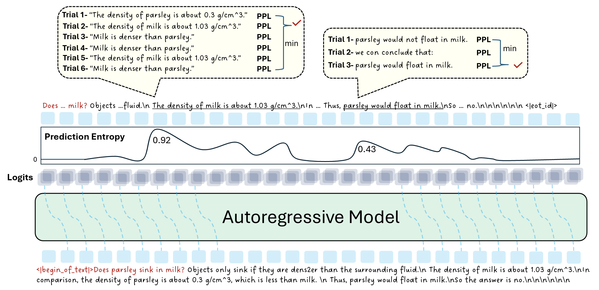
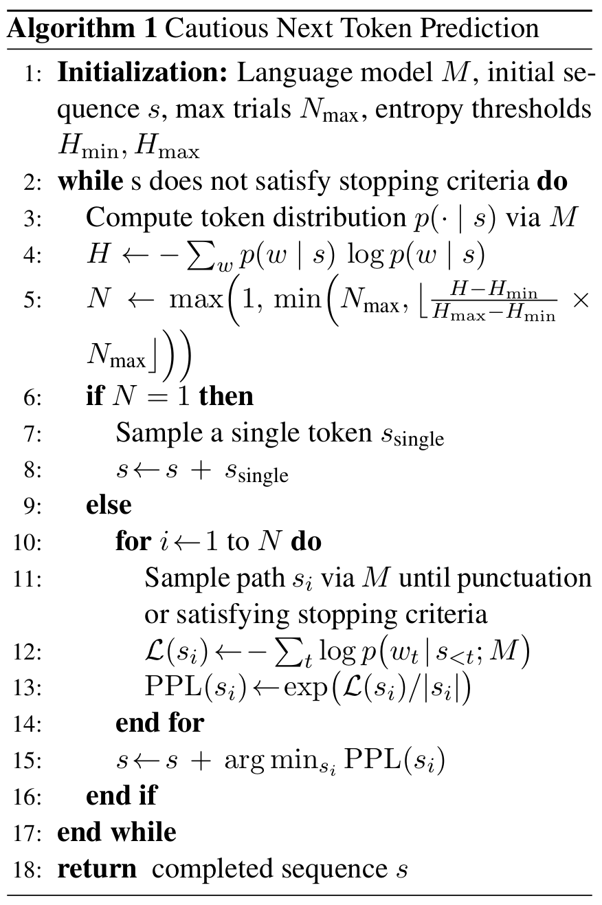

# Cautious Next Token Prediction (CNTP)

[](https://arxiv.org/abs/2507.03038) [](https://huggingface.co/papers/2507.03038)



> **Cautious Next Token Prediction**  
> *[Yizhou Wang](https://wyzjack.github.io/), [Lingzhi Zhang](https://owenzlz.github.io/), [Yue Bai](https://yueb17.github.io/), [Mang Tik Chiu](https://scholar.google.com/citations?user=TZMDZPwAAAAJ&hl=en), [Zhengmian Hu](https://scholar.google.com/citations?user=4eXiWWgAAAAJ&hl=en), [Mingyuan Zhang](https://kkhya.github.io/Mingyuan-Zhang.github.io/), [Qihua Dong](https://dddraxxx.github.io/), [Yu Yin](https://yin-yu.github.io/), [Sohrab Amirghodsi](https://scholar.google.com/citations?hl=en&user=aFrtZOIAAAAJ&view_op=list_works&sortby=pubdate), [Yun Fu](https://www1.ece.neu.edu/~yunfu/)*  
> **Findings of ACL 2025**


## Motivation
### Biological Intelligence perform better when cautious, do Digital Intelligence also benefit from cautiousness? ###

Ilya told us that next token prediction can mimic human brain functioning in intelligence, and can lead to AGI:

<a href="https://www.youtube.com/watch?v=Yf1o0TQzry8"></a>

If that is really the case (I believe so personally), this next token prediction paradigm should exhibit similar phenomenon as human brains. 

When human beings think about a problem, when they are uncertain in the process of thinking, they will be more cautious and explore multiple paths of possible solutions before choosing the most confident one. This is very common in real lifes of human beings. Specifically, in human exam settings, individuals often re-check key steps and sample alternative reasoning paths when unsure, only finalizing the path that best resonates with previously established facts. **Such progressive practice usually results in better human performance.**

By analogy, we hypothesize that LLMs might also benefit from conditionally branching into multiple future continuations whenever they sense high uncertainty. Our core insight is to compute an entropy measure that indicates how “unsure” the model is, and trigger more thorough exploration exactly at those points. Once possible continuations are sampled, the model’s own likelihood function can judge the best candidate to proceed with, mirroring how humans choose the strongest proof line. **In this work, we are thrilled to confirm the empirical effects of such practice on LLMs as well. Therefore, the answer to the question is yes: Digital Intelligence can also benefit from cautiousness!**


## Abstract

We propose **Cautious Next Token Prediction (CNTP)**, a novel training-free decoding strategy that adaptively samples multiple continuations based on model confidence. When the model exhibits high prediction entropy at a given step, CNTP samples multiple trials independently, stops at punctuation, and selects the trial with the lowest perplexity. This approach mimics human behavior: when uncertain, we explore multiple thinking paths before choosing the most confident one.

**Algorithm&nbsp;1 Cautious Next Token Prediction (CNTP)**




## Key Features

- **🎯 Adaptive Sampling**: Dynamically adjusts trial numbers based on model confidence
- **🚀 Training-Free**: No additional training or fine-tuning required
- **⚡ Efficient**: Focuses computational resources only where the model is uncertain
- **🎨 Balanced**: Maintains stochasticity, coherence, and creativity
- **🔧 Compatible**: Can be integrated with existing methods like self-consistency

## Performance Comparison

| Decoding Method | Stochasticity | Coherence | Creativity | Efficiency |
|----------------|:-------------:|:---------:|:----------:|:----------:|
| Stochastic Decoding | ✅ | ❌ | ✅ | ✅ |
| Greedy Decoding | ❌ | ✅ | ❌ | ✅ |
| Beam Search | ❌ | ✅ | ❌ | ❌ |
| **CNTP (Ours)** | ✅ | ✅ | ✅ | ✅ |

## TODO

- Add all the codes for the baseline methods


## Installation

### 1. Clone the repository

```bash
git clone https://github.com/wyzjack/CNTP.git
cd CNTP
```

### 2. Install the dependencies

For LLM experiments on GSM8K and StrategyQA, please install the dependencies in the `envs/gsm8k_strategyqa.yml` file.

```bash
conda env create -f envs/gsm8k_strategyqa.yml
conda activate gsm8k_strategyqa
cd custom_transformers_packages/gsm8k_strategyqa
pip install -e . 
```

For LLM experiments on MATH and TruthfulQA, please install the dependencies in the `envs/math_truthfulqa.yml` file.

```bash
conda env create -f envs/math_truthfulqa.yml
conda activate math_truthfulqa
cd custom_transformers_packages/math_truthfulqa
pip install -e . 
```

For VLM experiments on MMVet and MathVista, please install the dependencies in the `envs/mmvet_mathvista.yml` file.

```bash
conda env create -f envs/mmvet_mathvista.yml
conda activate mmvet_mathvista
cd custom_transformers_packages/mmvet_mathvista
pip install -e . 
```

## Reproduction

Our experiments were conducted on 8 A100 GPUs with 80GB memory. The following instructions are for reproducing all the main results of our paper.

### GSM8K and StrategyQA

```bash
cd experiments/SelfEval-Guided-Decoding
```
Follow the instructions in [SelfEval-Guided-Decoding/README.md](experiments/SelfEval-Guided-Decoding/README.md) to run the experiments.


### MATH and TruthfulQA

```bash
cd experiments/open-instruct
```
Follow the instructions in [open-instruct/README.md](experiments/open-instruct/README.md) to run the experiments.


### MMVet and MathVista

```bash
cd experiments/VLMEvalKit
```
Follow the instructions in [VLMEvalKit/README.md](experiments/VLMEvalKit/README.md) to run the experiments.


## Key Code Snippet

The core implementation of CNTP is to modify the [`_sample` function](https://github.com/huggingface/transformers/blob/241c04d36867259cdf11dbb4e9d9a60f9cb65ebc/src/transformers/generation/utils.py#L3159) of class `GenerationMixin` in `transformers.generation.utils.py` in the `transformers` library. Below is the code snippet of the modified function support of CNTP for `transformers==4.47.1`. 

```python
    def _sample_reflect_perplexity(
        self,
        input_ids: torch.LongTensor,
        logits_processor: LogitsProcessorList,
        stopping_criteria: StoppingCriteriaList,
        generation_config: GenerationConfig,
        synced_gpus: bool,
        streamer: Optional["BaseStreamer"],
        tokenizer: Optional["PreTrainedTokenizerBase"] = None,
        entropy_threshold_low: Optional[float] = None,
        entropy_threshold_high: Optional[float] = None,
        max_trials: Optional[int] = None,
        **model_kwargs,
    ) -> Union[GenerateNonBeamOutput, torch.LongTensor]:

        pad_token_id = generation_config._pad_token_tensor
        output_attentions = generation_config.output_attentions
        output_hidden_states = generation_config.output_hidden_states
        output_scores = generation_config.output_scores
        output_logits = generation_config.output_logits
        return_dict_in_generate = generation_config.return_dict_in_generate

        max_length = generation_config.max_length
        has_eos_stopping_criteria = any(hasattr(criteria, "eos_token_id") for criteria in stopping_criteria)
        do_sample = generation_config.do_sample

        scores = () if (return_dict_in_generate and output_scores) else None
        raw_logits = () if (return_dict_in_generate and output_logits) else None
        decoder_attentions = () if (return_dict_in_generate and output_attentions) else None
        cross_attentions = () if (return_dict_in_generate and output_attentions) else None
        decoder_hidden_states = () if (return_dict_in_generate and output_hidden_states) else None

        if return_dict_in_generate and self.config.is_encoder_decoder:
            encoder_attentions = model_kwargs["encoder_outputs"].get("attentions") if output_attentions else None
            encoder_hidden_states = (
                model_kwargs["encoder_outputs"].get("hidden_states") if output_hidden_states else None
            )

        batch_size, cur_len = input_ids.shape
        this_peer_finished = False
        unfinished_sequences = torch.ones(batch_size, dtype=torch.long, device=input_ids.device)
        model_kwargs = self._get_initial_cache_position(input_ids, model_kwargs)

        # Define punctuation tokens as a list
        punctuation_tokens = [tokenizer.encode(".", add_special_tokens=False)[0],
                            tokenizer.encode(",", add_special_tokens=False)[0],
                            tokenizer.encode("\n", add_special_tokens=False)[0],
                            tokenizer.encode("?", add_special_tokens=False)[0],
                            tokenizer.encode("!", add_special_tokens=False)[0],
                            tokenizer.encode(":", add_special_tokens=False)[0], 
                            tokenizer.encode(";", add_special_tokens=False)[0],
                            tokenizer.encode(")", add_special_tokens=False)[0],
                            tokenizer.encode("]", add_special_tokens=False)[0],
                            tokenizer.encode("}", add_special_tokens=False)[0]]

        max_trials = max_trials if max_trials is not None else 10
        min_trials = 1
        entropy_threshold_low = entropy_threshold_low if entropy_threshold_low is not None else 0.01
        entropy_threshold_high = entropy_threshold_high if entropy_threshold_high is not None else 1.5
        
        def calculate_entropy(probs):
            eps = 1e-10
            entropy = -torch.sum(probs * torch.log(probs + eps), dim=-1)
            return entropy

        def determine_trial_number(entropy):
            normalized_entropy = torch.clamp((entropy - entropy_threshold_low) / (entropy_threshold_high - entropy_threshold_low), 0, 1)
            num_trials = min_trials + (max_trials - min_trials) * normalized_entropy
            return int(num_trials.item())

        def clone_cache(past_key_values):
            if isinstance(past_key_values, tuple):
                return tuple(tuple(x.clone() for x in layer) for layer in past_key_values)
            elif isinstance(past_key_values, DynamicCache):
                new_cache = DynamicCache()
                for layer_idx in range(len(past_key_values.key_cache)):
                    new_cache.key_cache.append(past_key_values.key_cache[layer_idx].clone())
                    new_cache.value_cache.append(past_key_values.value_cache[layer_idx].clone())
                return new_cache
            elif isinstance(past_key_values, EncoderDecoderCache):
                return EncoderDecoderCache(
                    clone_cache(past_key_values.self_attention_cache),
                    clone_cache(past_key_values.cross_attention_cache)
                )
            elif isinstance(past_key_values, StaticCache):
                return past_key_values.clone()
            return past_key_values

        while self._has_unfinished_sequences(
            this_peer_finished, synced_gpus, device=input_ids.device, cur_len=cur_len, max_length=max_length
        ):
            original_cache = None
            if "past_key_values" in model_kwargs:
                original_cache = clone_cache(model_kwargs["past_key_values"])
            model_inputs = self.prepare_inputs_for_generation(input_ids, **model_kwargs)

            model_inputs.update({"output_attentions": output_attentions} if output_attentions else {})
            model_inputs.update({"output_hidden_states": output_hidden_states} if output_hidden_states else {})

            outputs = self(**model_inputs, return_dict=True)

            if synced_gpus and this_peer_finished:
                continue  

            next_token_logits = outputs.logits[:, -1, :].clone().float()
            next_token_logits = next_token_logits.to(input_ids.device)
            next_token_scores = logits_processor(input_ids, next_token_logits)
            probs = nn.functional.softmax(next_token_scores, dim=-1)

            # Calculate entropy and determine number of trials
            entropy = calculate_entropy(probs)
            num_trials = determine_trial_number(entropy)

            if num_trials > 1:
                print("entropy: {}, num_trials: {}".format(entropy, num_trials))
                
                # Generate multiple trials
                trial_sequences = []
                trial_scores = []
                trial_outputs = []
                trial_model_kwargs = []
                
                for trial_idx in range(num_trials):
                    
                    # print(trial_idx)
                    trial_tokens = []
                    trial_probs = []  # Store individual token probabilities instead of joint prob
                    trial_step_scores = []  # Store scores for each step
                    trial_step_logits = []  # Store logits for each step
                    curr_input_ids = input_ids.clone()
                    
                    # Clone model kwargs and cache for this trial
                    curr_model_kwargs = copy.deepcopy(model_kwargs)

                    if original_cache is not None:
                        curr_model_kwargs["past_key_values"] = clone_cache(original_cache)

                    while True:
                        curr_inputs = self.prepare_inputs_for_generation(
                            curr_input_ids,
                            **curr_model_kwargs
                        )

                        curr_inputs.update({"output_attentions": output_attentions} if output_attentions else {})
                        curr_inputs.update({"output_hidden_states": output_hidden_states} if output_hidden_states else {})
                        
                        curr_outputs = self(**curr_inputs, return_dict=True)
                        curr_logits = curr_outputs.logits[:, -1, :].clone().float()
                        curr_logits = curr_logits.to(curr_input_ids.device)
                        curr_scores = logits_processor(curr_input_ids, curr_logits)
                        curr_probs = nn.functional.softmax(curr_scores, dim=-1)

                        # Store scores and logits for each step
                        if output_scores:
                            trial_step_scores.append(curr_scores)
                        if output_logits:
                            trial_step_logits.append(curr_logits)
                        
                        # Sample next token
                        curr_token = torch.multinomial(curr_probs, num_samples=1).squeeze(1)
                        trial_tokens.append(curr_token)
                        trial_probs.append(curr_probs[0, curr_token.item()].item())
                                   
                        curr_input_ids = torch.cat([curr_input_ids, curr_token.unsqueeze(1)], dim=-1)
                        curr_model_kwargs = self._update_model_kwargs_for_generation(
                            curr_outputs, curr_model_kwargs, is_encoder_decoder=self.config.is_encoder_decoder
                        )

                        # Check stopping criteria for the current trial's input_ids
                        # Convert to tuple for stopping criteria compatibility
                        accumulated_scores = tuple(trial_step_scores) if output_scores else None
                        trial_should_stop = stopping_criteria(curr_input_ids, accumulated_scores).any()
                        if trial_should_stop or (curr_token.item() in punctuation_tokens):
                            break
                    
                    trial_sequences.append(torch.stack(trial_tokens))
                    trial_scores.append(trial_probs)  # Store list of probabilities
                    trial_outputs.append((curr_outputs, trial_step_scores, trial_step_logits))  # Store outputs along with step scores/logits
                    trial_model_kwargs.append(curr_model_kwargs)

                    # delete
                    del curr_outputs
                    del curr_logits
                    del curr_scores
                    del curr_probs
                    del curr_input_ids
                    del curr_model_kwargs
                    del curr_inputs
                    torch.cuda.empty_cache()
                    gc.collect()
                
                # Calculate normalized joint probabilities using only the first min_length tokens
                perplexities = []
                for probs in trial_scores:
                    # Calculate negative log likelihood
                    nll = -sum(np.log(p) for p in probs)
                    # Calculate perplexity: exp(average negative log likelihood)
                    sequence_length = len(probs)
                    perplexity = np.exp(nll / sequence_length)
                    perplexities.append(perplexity)

                # Select best trial based on lowest perplexity
                best_trial_idx = min(range(len(perplexities)), key=lambda i: perplexities[i])

                # Get the full sequence for the best trial (no truncation needed)
                next_tokens = trial_sequences[best_trial_idx].squeeze(1).unsqueeze(0)
                best_outputs, best_step_scores, best_step_logits = trial_outputs[best_trial_idx]

                # Store scores, attentions and hidden_states for the best trial
                if return_dict_in_generate:
                    if output_scores:
                        for token_score in best_step_scores:
                            scores += (token_score,)
                    if output_logits:
                        for token_logit in best_step_logits:
                            raw_logits += (token_logit,)

                # finished sentences should have their next token be a padding token
                if has_eos_stopping_criteria:
                    next_tokens = next_tokens * unfinished_sequences + pad_token_id * (1 - unfinished_sequences)

                # update generated ids, model inputs, and length for next step
                input_ids = torch.cat([input_ids, next_tokens], dim=-1)
                if streamer is not None:
                    streamer.put(next_tokens.cpu())
                model_kwargs = trial_model_kwargs[best_trial_idx]

                # clear trial data
                trial_sequences.clear()
                trial_scores.clear()
                trial_outputs.clear()
                trial_model_kwargs.clear()

                unfinished_sequences = unfinished_sequences & ~stopping_criteria(input_ids, scores)
                this_peer_finished = unfinished_sequences.max() == 0
                cur_len += next_tokens.shape[-1]
                # Otherwise a reference to outputs is kept which keeps the logits alive in the next iteration

                del outputs
                del best_outputs
                del best_step_scores
                del best_step_logits

            else:

                # Store scores, attentions and hidden_states when required
                if return_dict_in_generate:
                    if output_scores:
                        scores += (next_token_scores,)
                    if output_logits:
                        raw_logits += (next_token_logits,)
                    if output_attentions:
                        decoder_attentions += (
                            (outputs.decoder_attentions,) if self.config.is_encoder_decoder else (outputs.attentions,)
                        )
                        if self.config.is_encoder_decoder:
                            cross_attentions += (outputs.cross_attentions,)

                    if output_hidden_states:
                        decoder_hidden_states += (
                            (outputs.decoder_hidden_states,)
                            if self.config.is_encoder_decoder
                            else (outputs.hidden_states,)
                        )

                # token selection
                if do_sample:
                    probs = nn.functional.softmax(next_token_scores, dim=-1)
                    # TODO (joao): this OP throws "skipping cudagraphs due to ['incompatible ops']", find solution
                    next_tokens = torch.multinomial(probs, num_samples=1).squeeze(1)
                else:
                    next_tokens = torch.argmax(next_token_scores, dim=-1)

                # finished sentences should have their next token be a padding token
                if has_eos_stopping_criteria:
                    next_tokens = next_tokens * unfinished_sequences + pad_token_id * (1 - unfinished_sequences)

                # update generated ids, model inputs, and length for next step
                input_ids = torch.cat([input_ids, next_tokens[:, None]], dim=-1)
                # print(input_ids.shape)
                if streamer is not None:
                    # print("streamer is not None")
                    streamer.put(next_tokens.cpu())
                model_kwargs = self._update_model_kwargs_for_generation(
                    outputs,
                    model_kwargs,
                    is_encoder_decoder=self.config.is_encoder_decoder,
                )

                unfinished_sequences = unfinished_sequences & ~stopping_criteria(input_ids, scores)
                this_peer_finished = unfinished_sequences.max() == 0
                cur_len += 1

                del outputs

            del original_cache


        if streamer is not None:
            streamer.end()

        # Before returning, truncate everything to max_length if needed
        max_length = stopping_criteria.max_length
        if input_ids.shape[1] > max_length:
            input_ids = input_ids[:, :max_length]

        
        # clear unused variables
        if 'trial_sequences' in locals():
            del trial_sequences
        if 'trial_scores' in locals():
            del trial_scores
        if 'trial_outputs' in locals():
            del trial_outputs
        if 'trial_model_kwargs' in locals():
            del trial_model_kwargs
        if 'normalized_scores' in locals():
            del normalized_scores
        if 'best_trial_idx' in locals():
            del best_trial_idx
        if 'min_length' in locals():
            del min_length
        if 'trial_tokens' in locals():
            del trial_tokens
        if 'trial_probs' in locals():
            del trial_probs
        if 'trial_step_scores' in locals():
            del trial_step_scores
        if 'trial_step_logits' in locals():
            del trial_step_logits
        
        torch.cuda.empty_cache()
        # force garbage collection
        gc.collect()

        if return_dict_in_generate:
            if self.config.is_encoder_decoder:
                return GenerateEncoderDecoderOutput(
                    sequences=input_ids,
                    scores=scores,
                    logits=raw_logits,
                    encoder_attentions=encoder_attentions,
                    encoder_hidden_states=encoder_hidden_states,
                    decoder_attentions=decoder_attentions,
                    cross_attentions=cross_attentions,
                    decoder_hidden_states=decoder_hidden_states,
                    past_key_values=model_kwargs.get("past_key_values"),
                )
            else:
                return GenerateDecoderOnlyOutput(
                    sequences=input_ids,
                    scores=scores,
                    logits=raw_logits,
                    attentions=decoder_attentions,
                    hidden_states=decoder_hidden_states,
                    past_key_values=model_kwargs.get("past_key_values"),
                )
        else:
            return input_ids
```


## Citation

If you find CNTP useful, please cite our paper:

```bibtex
@inproceedings{wang2025cntp,
    title={Cautious Next Token Prediction},
    author={Wang, Yizhou and Zhang, Lingzhi and Bai, Yue and Chiu, Mang Tik and Hu, Zhengmian and Zhang, Mingyuan and Dong, Qihua and Yin, Yu and Amirghodsi, Sohrab and Fu, Yun},
    booktitle={Findings of the Association for Computational Linguistics: ACL 2025},
    year={2025}
}
```

## License

This project is licensed under the MIT License - see the [LICENSE](LICENSE) file for details.

## Acknowledgments

In this code we heavily rely on the public Github repos [open-instruct](https://github.com/allenai/open-instruct.git), [SelfEval-Guided-Decoding](https://github.com/YuxiXie/SelfEval-Guided-Decoding.git) and [VLMEvalKit](https://github.com/open-compass/VLMEvalKit.git). Great thanks to them! We also greatly thank the anounymous ACL'25 reviewers for the constructive comments to help us improve the paper.

## Contact

- **Yizhou Wang**: wyzjack990122@gmail.com    

---

<div align="center">

**[Paper](https://arxiv.org/abs/2507.03038) | [Code](https://github.com/wyzjack/CNTP) | [ACL 2025](https://2025.aclweb.org/program/find_papers/)**

*Making LLMs more cautious and more intelligent* 🤔

</div>
